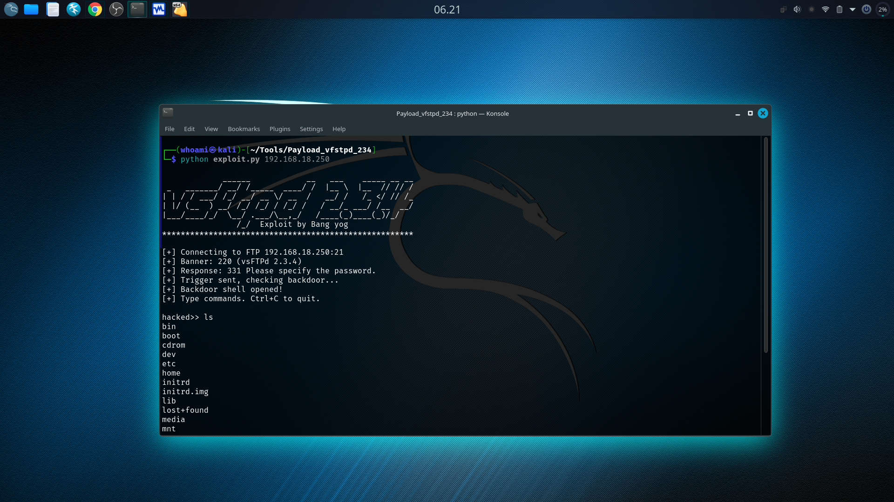

# Eksploit vsftpd 2.3.4
This exploit was created to update the payload that is no longer supported in the default Kali Linux version, as the default version no longer supports it due to the latest Python version. Please use it wisely.

# How to use tools 
```
git clone https://github.com/YogaRmdn/Payload-vsftpd-2.3.4.git
cd Payload-vsftpd-2.3.4
python exploit.py ip_target
```

# Screenshot

